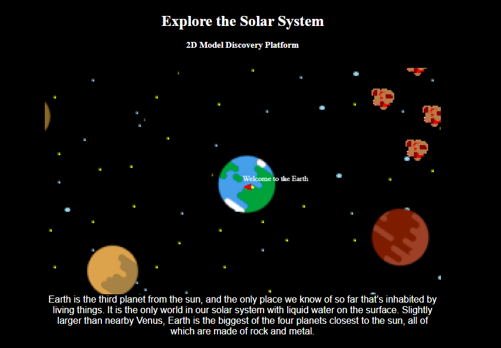

# Solar System Model Exploration #

## Explore a cartoon rendition of the Solar System ##

[Solar System Model Game](https://lively-seahorse-84e71e.netlify.app/)

Use Arrow Keys on Computer to control SpaceShip, and explore!

Future Features include animations, random/secret events, planet visits

Currently the spaceship travels through the Solar System and when you are over a Planet, information about that planet is displayed